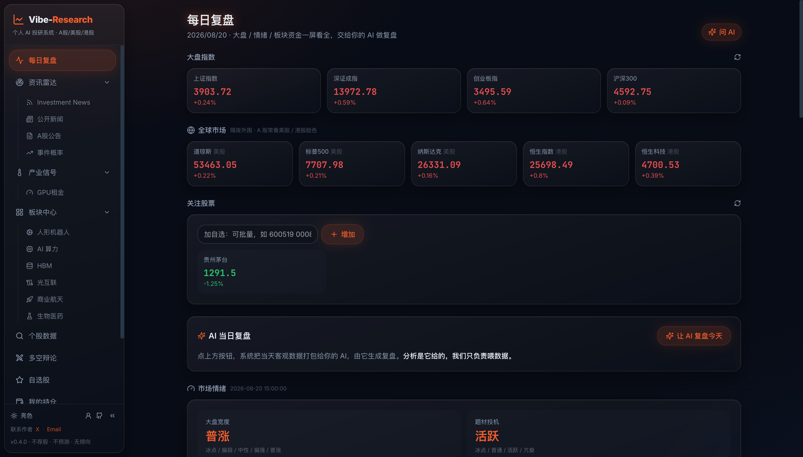
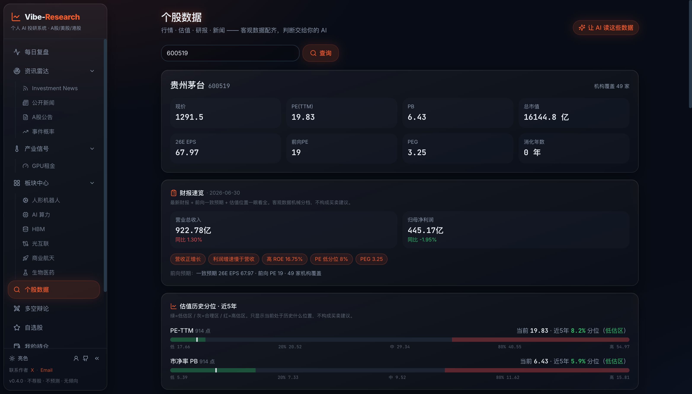
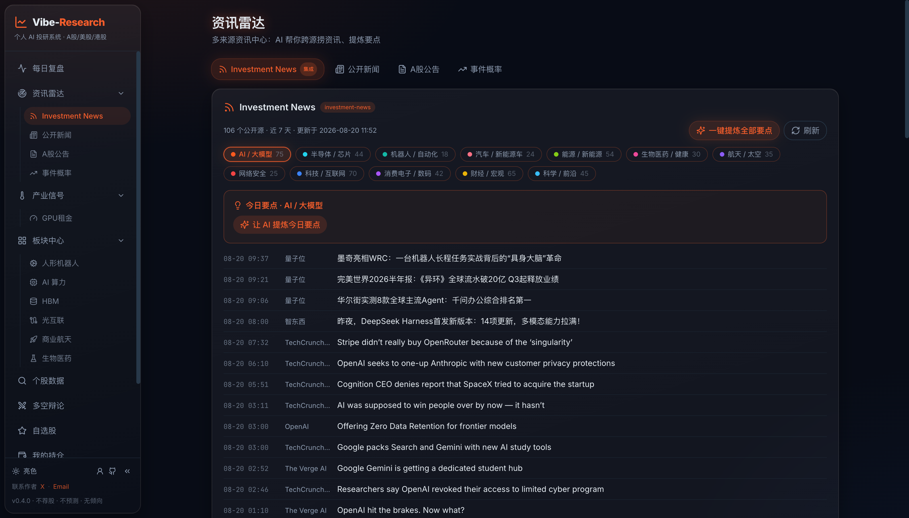

<p align="center"><a href="README.md">简体中文</a> | <b>English</b></p>

<h1 align="center">Vibe-Research · Your Personal AI Research Dashboard (A-share / US / HK)</h1>

[](LICENSE)
[](https://www.python.org/)
[](https://react.dev/)
[](https://fastapi.tiangolo.com/)
[](https://github.com/simonlin1212/Vibe-Research/stargazers)
[](README.md)

<p align="center">
  <a href="https://viberesearch.wiki">Website</a> ·
  <a href="#screenshots">Screenshots</a> ·
  <a href="#features">Features</a> ·
  <a href="#data-sources">Data Sources</a> ·
  <a href="#quick-start">Quick Start</a> ·
  <a href="#bring-your-own-ai">Bring Your Own AI</a> ·
  <a href="#compliance">Compliance</a>
</p>

> **Vibe-Research: Your Personal Trading Research Agent.**
>
> An open dashboard for China A-share (plus US / HK): it wires up all the data and plugs into **your own AI / agent** — it never recommends a stock. You bring the model, it brings the data.

Vibe-Research is an open-source research dashboard built primarily for **China A-share**, with US and HK markets included (A-share traders usually check overnight Wall Street and Hong Kong first, so the data is wired up too).

It does not make decisions for you. It pulls together quotes, analyst reports, valuation, financials, filings, fund flows and news into one clean dashboard, then leaves an interface where **you plug in your own AI**. The direction and the conclusions come from the model or agent *you* configure.

## Screenshots

**Daily Review** — indices, market breadth, sector fund flows and turnover leaders on one screen, then hand it to your AI



<table>
<tr>
<td width="50%">

**Stock Data** — earnings snapshot, valuation percentile and fund flows in one view



</td>
<td width="50%">

**News Radar** — 108 public feeds across 12 industry tracks, distilled on demand



</td>
</tr>
</table>

---

## Features

| Page | What's in it |
|---|---|
| 📊&nbsp;**Daily&nbsp;Review** | Index quotes · **Global markets** (Dow / S&P / Nasdaq overnight + Hang Seng / HS Tech) · Watchlist quotes · **Short-term sentiment** (consecutive limit-up ladder, seal rate, break rate, promotion rate) · **Market-wide turnover top 20** · Market breadth · Sector fund-flow trends · Sector rotation · One-click AI review |
| 📡&nbsp;**News&nbsp;Radar** | 108 public RSS feeds across 12 tracks · AI-distilled "today's takeaways" · A-share filings and public news linked to your watchlist |
| 🔍&nbsp;**Stock&nbsp;Data** | **A-share**: quotes · valuation matrix (forward PE / PEG) · **earnings snapshot** · valuation percentile vs. own 5-year history · key financials · analyst reports · filings · news · **fund flows** (margin trading, shareholder count, main-force flow, dividends, block trades) · top-list (Dragon-Tiger) · lockup expiry · sector membership · trending concepts · investor Q&A.<br>**US / HK / KR** (enter `AAPL` / `00700` / `005930.KS`): quotes · market cap · key financials (KR is quotes only) |
| ⚔️&nbsp;**Bull&nbsp;vs&nbsp;Bear** | **Multi-agent**: the backend first pulls a 13-item factual dossier, then a **bull researcher** and a **bear researcher** argue from that same data (optional rebuttal round), and a **neutral moderator** summarizes "what both sides agree on / where they actually disagree / what to verify / what data is missing". **Deliberately produces no buy or sell conclusion.**<br>⏱ Heavier than a chat: ~100s and 3 model calls per round — see [cost](#-what-one-debate-costs-read-before-you-run-it) first |
| ⭐&nbsp;**Watchlist** | **Paste a whole batch of tickers at once** (commas, spaces or newlines) · one-screen table (price, change, PE, PB, turnover) · **live quotes toggle** (top right, off by default; refreshes every 3s during trading hours, auto-pauses outside them and when the tab is hidden) · hand the whole list to your AI. Stored locally |
| 🧩&nbsp;**Sectors** | Sector and value-chain skeletons |
| 💼&nbsp;**Portfolio** | Enter cost and size, see live P&L · closed-position log (local only, never uploaded) |
| 📄&nbsp;**My Reports** | Drag-and-drop your own research PDFs / Word / spreadsheets · auto-filed by industry from the filename · download or delete. **Stored in your local deploy directory only** |
| 📝&nbsp;**Research Notes** | Save AI reviews, takeaways, Q&A and debates locally · **reflection audit**: have the AI audit its own reasoning — which claims are backed by data, which are speculation, where the weakest link is, and what to check next |
| 🔌&nbsp;**AI Status** | Read-only status page: models are configured only in the server-side `settings.json` (chmod 600) · copyable config template + startup guidance · MCP (mount into Claude Code and other agents) |

> **Built-in analysis framework**: when your AI analyzes a stock it organizes findings across five dimensions — valuation, fund flows, earnings quality, industry cycle, catalysts and risks. The framework only prescribes *how to read the data*, never what to buy. The direction still comes from your own model.
>
> Limit-up lists and turnover rankings are **objective public data, presented as-is — no recommendation, no prediction**.

## Data Sources

Three public data toolkits are **vendored directly into this repo** — `git clone` and everything works, no extra downloads or wiring.

### A-share full-stack data · AStockData

- Lives in [`a-stock-data/`](a-stock-data/) (v3.6.0). Ten data layers, 47 endpoints, 15 sources, with fallback sources when a primary one gets blocked. [`a-stock-data/SKILL.md`](a-stock-data/SKILL.md) **embeds every call as runnable code** — self-contained, with built-in rate limiting for Eastmoney endpoints.
- **Covers**: quotes / candles / analyst reports / consensus estimates / valuation / historical percentiles / financial statements / filings / Dragon-Tiger list / margin trading / block trades / shareholder counts / dividends / fund flows / lockup expiry / concept sectors / limit-up sentiment / ETF options / investor Q&A / market-wide industry rankings.
- **For agents**: running this repo with Claude Code or similar? Point them at `SKILL.md` — every endpoint has copy-paste ready code. The backend data layer (`backend/astock.py`) is ported from it.
- **Runtime deps**: `pip install mootdx requests pandas stockstats`
- **Upstream**: <https://github.com/simonlin1212/a-stock-data> — the vendored copy is a pinned snapshot and keeps working even if you never update it.

### US / HK data · global-stock-data

- Lives in [`global-stock-data/`](global-stock-data/) (v2.0.3). 13 data layers, 30+ endpoints, 11 sources, no auth required — quotes, candles, technicals, financial statements, fund flows, options (CBOE official chain with full Greeks and 0DTE flow), FINRA short volume, and the SEC EDGAR filing stream plus market-wide screener. Every source is labeled with its compliance tier.
- `backend/gstock.py` ports the Eastmoney-domain subset: global indices (the "Global markets" row on Daily Review) plus US/HK quotes and key financials.
- **Korean stocks**: append `.KS` to the 6-digit code (e.g. Samsung `005930.KS`). ⚠️ KR codes are also 6 digits like A-share tickers, so **the suffix is required** for correct routing. Quotes only, no financials. Taiwan is covered via US ADRs (e.g. `TSM`).
- **Upstream**: <https://github.com/simonlin1212/global-stock-data>

### Global news · investment-news

- 108 public RSS feeds across 12 industry tracks, merged into `backend/newsradar.py`. Standard library only, no API keys.
- **Upstream**: <https://github.com/simonlin1212/investment-news>

> All data comes from public sources. Vibe-Research only performs objective data aggregation and presents public rankings as-is — **it does not recommend stocks, predict price moves, time trades, or assign subjective scores**. What you do with the data is up to you and your AI.

## Architecture

One data layer, three AI outlets:

```
Vibe-Research/
├── a-stock-data/      A-share data toolkit (vendored v3.6.0, ready to use)
├── global-stock-data/ US / HK data toolkit (vendored v2.0.3, ready to use)
├── backend/           FastAPI :8900 (data/business APIs) + local LangGraph Server :2024 (all AI)
│   ├── astock.py        A-share data
│   ├── gstock.py        US / HK data
│   ├── newsradar.py     News radar
│   ├── market.py        Market breadth + sector fund flows + global indices
│   ├── portfolio.py     Portfolio (stored in your local user directory)
│   ├── tools.py         AI tool layer (24 data tools shared by every graph and MCP)
│   ├── mcp_server.py    MCP server (for Claude Code and other agents)
│   ├── langgraph.json   Six LangGraph graphs (agent / embedded_agent / debate /
│   │                    reflection / daily_review / news_digest)
│   └── agent/           Unified AI runtime: model factory + neutral policy + tool executor
│                        + Skills + workflow YAML loading/compiling (agent/workflows/*.yaml)
└── frontend/          Vite + React 19 + TS + Tailwind :5899
```

**Tiered dependencies**: quotes (Tencent) and reports/filings (Eastmoney) work with a minimal install. `akshare` / `mootdx` are imported lazily — if missing, only those endpoints return 501 with an install hint; the service still runs.

## Quick Start

Requires **Python 3.11+** (the Agent workspace LangGraph runtime). `langgraph dev` does not install
requirements for you — run `pip install -r requirements.txt` first.

```bash
# Data / business backend (FastAPI :8900 — quotes, portfolio, reports, …)
cd backend && python3 -m venv .venv && .venv/bin/pip install -r requirements.txt
.venv/bin/python -m uvicorn app:app --host 127.0.0.1 --port 8900

# AI runtime (local LangGraph Server :2024, six graphs; loopback only — never bind LAN/public addresses)
.venv/bin/langgraph dev --host 127.0.0.1 --port 2024 --no-browser

# Frontend (:5899, /api proxied to 8900 and /agent-api to 2024)
cd ../frontend && npm install && npm run dev
# Open http://localhost:5899
```

## Bring Your Own AI

Every model call runs on the local LangGraph Server (`127.0.0.1:2024`) through six graphs:
`agent` (workspace), `embedded_agent` (page ask-AI), `debate`, `reflection`, `daily_review`
and `news_digest`. Models and keys come **only** from a local static settings file (default
`~/.vibe-research/agent/settings.json`, override with `VR_AGENT_SETTINGS`); it is read once
when the Agent Server starts:

```bash
mkdir -p ~/.vibe-research/agent/skills
# write the template below to ~/.vibe-research/agent/settings.json (apiKey = your own)
chmod 600 ~/.vibe-research/agent/settings.json
```

```json
{
  "model": {
    "provider": "openai",
    "name": "your-model",
    "apiKey": "YOUR_API_KEY",
    "baseURL": "https://your-provider.example/v1",
    "temperature": 0.2,
    "thinking": false
  },
  "skills": { "path": "~/.vibe-research/agent/skills" },
  "mcpServers": {}
}
```

Notes:

- **No model keys in the browser anymore.** The settings page is read-only: it shows a
  redacted summary (model name / host / Skill & MCP counts / config path + restart
  guidance); `YOUR_API_KEY` in the template is a placeholder only. Old `vr-llm` /
  `vr-askai-chat:*` browser values are pre-migration data — never read, migrated or deleted.
- **FastAPI keeps data/business APIs only** (quotes, portfolio, reports, news radar and the
  read-only `/api/agent/status`). `VR_API_KEY` protects FastAPI in public deployments; it
  does **not** protect LangGraph — `/agent-api` is a local dev proxy and must never be
  reverse-proxied publicly.
- **MCP (for Claude Code and other agents)**: mount the backend as an MCP server so your
  agent can call Vibe-Research's data tools with its own subscription. See
  [`backend/README.md`](backend/README.md).
- **Histories stay on your machine**: ask-AI / debate / reflection / review / digest
  histories live in local LangGraph checkpoints (recoverable after page refresh; each
  business page has its own history section to view / rerun / explicitly delete).

## How the Multi-Agent Part Is Designed

Open-source multi-agent finance frameworks (TradingAgents, ai-hedge-fund and friends) end their pipeline with a trader or portfolio_manager role that outputs "buy / sell / how much". **This project deliberately omits that layer.**

Here the endpoint of the multi-agent flow is **disagreement**, not a verdict:

```
① Factual dossier   backend pulls 13 objective datasets (no LLM involved)
                     ↓  both sides argue over the same data — nobody can win by making numbers up
② Bull researcher   builds the case: thesis + supporting evidence + what must hold for it to work
③ Bear researcher   builds the counter-case: doubts + risk evidence + what must hold for it to work
   (optional)       rebuttal round: address each point, concede what's conceded, refute with data
④ Neutral moderator shared ground / real disagreements (missing data or differing reads?) /
                     what to verify / what data is absent
```

Deliberate constraints:

- **Dossier first** — the model isn't left to remember which tool to call. Data is deterministic and reproducible; missing items are stated in the dossier with an explicit "do not speculate" instruction.
- **Every claim must cite the specific data it rests on**; anything unsupported must be labeled as such.
- **The moderator does not pick a winner** and gives no rating or lean — its output is "here's what to look at next".
- Rate-limited endpoints are fetched **serially**: the throttle is timestamp-based rather than lock-based, so concurrency would blow straight through it.

### What one debate costs (read before you run it)

A debate is much heavier than a chat — it runs a full pipeline and **every role carries the complete dossier**. Measured:

| | 1 round | 2 rounds (with rebuttal) |
|---|---|---|
| Model calls | **3** | **5** |
| Input sent | ~35k CJK chars | ~60k |
| Output | ~4k | ~7k |
| Wall clock | **~100–120s** | ~3 min |

Roughly 35s of that is fetching the dossier — a dozen public endpoints, **zero tokens**. The rest is generation.

**To keep costs down:**

1. **One round is usually enough.** Two rounds doubles everything.
3. **A debate doesn't need an expensive model.** The data is already in the dossier; the model only organizes and expresses it. Save your budget for your own deep questions.
4. **Don't spam it.** The dossier hits a dozen throttled endpoints.

### Reflection audit

The same idea applied to writing you already have: audit the reasoning and surface the parts that *sound* reasonable but aren't backed by anything. In testing it reliably catches things like "widely recognized by institutions" (generalizing from three data points) or "frequently raised estimates" (never quantified).

Much cheaper — **a single model call** over the text you selected.

## Agent Workspace and Unified AI Workflows

The **Agent Workspace** and every AI conversation/analysis workflow run on the same **local
LangGraph Server** (`127.0.0.1:2024`, started separately from FastAPI): threads, runs,
checkpoints and human-in-the-loop approvals are persisted natively. The workspace is the
general-purpose agent (free conversation + MCP / Skills); page ask-AI, debate, reflection,
daily review and news digest are five dedicated graphs with isolated persistence — workflow
histories appear only on their own business pages (debate on the debate page, reflection on
the research-notes page, review/digest on their pages), never in the workspace list, and
there is no global history page.

Like the rest of the product the agent **organizes objective data and analysis frameworks —
it never gives buy/sell conclusions**. Configuration comes from the settings file described
in "Bring Your Own AI" above.

Highlights:

- **Keys stay in the local settings file**: model/MCP keys are stored in plaintext inside `settings.json`;
  run `chmod 600 ~/.vibe-research/agent/settings.json` (the server warns on stderr if the permissions are
  too broad). They never enter thread metadata, checkpoints, logs or frontend requests. Old `vr-llm`
  browser values are no longer read (left on disk, unused).
- **Per-call MCP approval**: external MCP tools require approval, with exactly two decisions each time —
  approve or reject. Rejected calls return to the conversation as rejections, never executing silently.
- **Read-only Skills confined to the configured root**: the model explores the local skill library via
  `ls` / `read_file` (metadata first, full body on demand); path escapes out of the root are rejected.
- **The CORS limit, stated honestly**: the Agent server's origin allowlist only permits the local frontend
  (`http://127.0.0.1:5899`). It prevents an unrelated website from reading LangGraph responses. It is not
  authentication or CSRF protection: browser simple requests can still blindly create threads or submit
  runs and consume model/data-source quota. This residual risk is accepted only for loopback, single-user
  operation — never bind the Agent server to LAN/public addresses.
- Old custom Agent sessions (JSON files) are **not migrated**: the workspace starts empty after the
  upgrade; the files remain untouched on disk.

## Tests

```bash
cd backend && .venv/bin/pip install -r requirements-dev.txt
.venv/bin/pytest -m "not live"   # offline unit + API tests (fast, no network)
.venv/bin/pytest -m live         # verifies live data source shapes (run before releases)

# frontend
cd ../frontend && npm install
npm test          # node --test page smoke tests
npm run test:unit # vitest component/unit tests
npm run build     # tsc -b && vite build
```

### Agent Workspace browser tests (Playwright)

Three isolated services (FastAPI :8873 + LangGraph :2873 + Vite :5873). LangGraph runs a deterministic
scripted model and a stdio fake MCP against a fresh temp data root per run — **it never touches the regular
services on 8900/2024 or your `~/.vibe-research/`**:

```bash
cd frontend
npm run test:e2e:install   # first time: install Chromium (on restricted networks set PLAYWRIGHT_DOWNLOAD_HOST to a reachable mirror)
npm run test:e2e          # serial run: full interaction matrix + desktop/mobile screenshots + proxy & CORS assertions
```

## Changelog

See [CHANGELOG.md](./CHANGELOG.md). The single source of truth for the version is `frontend/package.json`; the backend API, the UI and the MCP `serverInfo` all read from it.

## Compliance

- Objective data aggregation and public-ranking display only: **no stock recommendations, no price predictions, no trade timing, no return promises, no subjective scoring.** Neutral by design.
- Limit-up lists and turnover rankings are **objective public data** (the same numbers Eastmoney and Tonghuashun publish); the product displays them as-is with nothing attached.
- All analytical direction comes from the AI *you* configure, not from this project. There are no buy/sell buttons in the UI, and valuation percentiles mark position only — no lines suggesting when to act.
- **Your portfolio, watchlist, uploaded reports and API keys stay on your machine.** Nothing is uploaded; nothing enters the repo.
- Portfolio and uploaded reports default to `~/.vibe-research/` (override with `VR_DATA_DIR` / `VR_REPORTS_DIR`) — outside the project folder, so re-downloading or overwriting the project never loses your data.

## Related Projects

All from the same open-source stack ([`simonlin1212`](https://github.com/simonlin1212)):

| Repo | What it is |
|---|---|
| [**a-stock-data**](https://github.com/simonlin1212/a-stock-data) | A-share full-stack data toolkit (10 layers · 44 endpoints · 15 sources) — this project's A-share engine |
| [**global-stock-data**](https://github.com/simonlin1212/global-stock-data) | US / HK full-stack data toolkit (13 layers · 30+ endpoints · 11 sources) |
| [**investment-news**](https://github.com/simonlin1212/investment-news) | Global industry news dashboard (12 tracks mapped to A-share sectors) |
| [**Agent-Staff**](https://github.com/simonlin1212/Agent-Staff) | Agentify a company: one AI agent per department plus a chief-of-staff |

## Contact

Built by **Simon**, independent developer.

- 🐦 X: [@linsizhen](https://x.com/linsizhen)
- ✉️ Email: <simonlin0423@gmail.com>
- 💬 Happy to talk about **enterprise AI adoption**; for project issues please open an [Issue](https://github.com/simonlin1212/Vibe-Research/issues).

## Acknowledgements

- A-share data engine: [a-stock-data](https://github.com/simonlin1212/a-stock-data)
- US / HK data engine: [global-stock-data](https://github.com/simonlin1212/global-stock-data)
- News: [investment-news](https://github.com/simonlin1212/investment-news)
- UI design language referenced with thanks: [HKUDS/Vibe-Trading](https://github.com/HKUDS/Vibe-Trading) (UI inspiration only; the implementation here is separate)

## Disclaimer

This project is for learning and research purposes and **does not constitute investment advice**. The dashboard performs objective data aggregation and displays public rankings — it does not recommend stocks, predict price movements, time trades, or promise returns. All analytical conclusions come from the AI you configure yourself and have nothing to do with this project. Markets carry risk; verify independently and decide for yourself.

## Support

If this tool saved you time, a coffee is appreciated.

<p align="center">
  <a href="https://buymeacoffee.com/simonlin1212"></a>
</p>

## License

MIT
